# Todo App
    Nama    : Wanhardo Jawak
    NRP     : 5025251155
    Prodi   : Teknik Informatika
    Kelas   : Pemrograman Web (A)

## Deskripsi Singkat
- Header terdiri judul My Todo List dan deskripsi singkat. 
- Panel kiri terdiri dari daftar todo, status todo, dan form add new todo. 
- Panel kanan berisi detail todo yang dipilih, terdiri dari judul, deskripsi, status, serta tombol simpan, edit dan hapus. 
- Footer berisi tahun dan nama pembuat. 
- Terdapat daftar todo dengan status pending atau completed.
- Terdapat form untuk menambahkan todo baru yang berisi judul, deskripsi dan deadline todo.
- Terdapat bagian detail untuk melihat detail, mengedit atau menghapus todo yang dipilih.
- Terdapat tombol Mode Gelap/Terang untuk menyesuaikan tema.

## Dokumentasi dan Preview
### Desktop

Pada tampilan desktop, daftar todo dan detail todo berada dalam dua panel yang berdampingan.
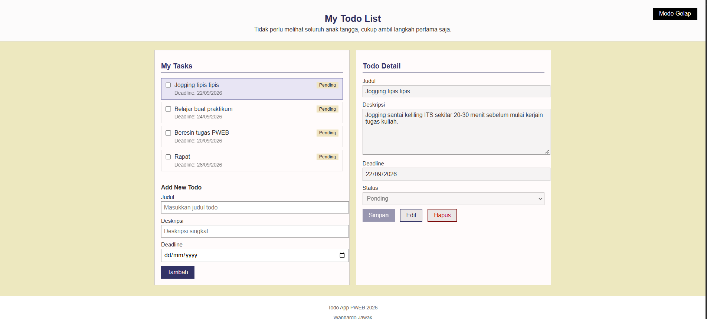

Default desktop dalam dark mode
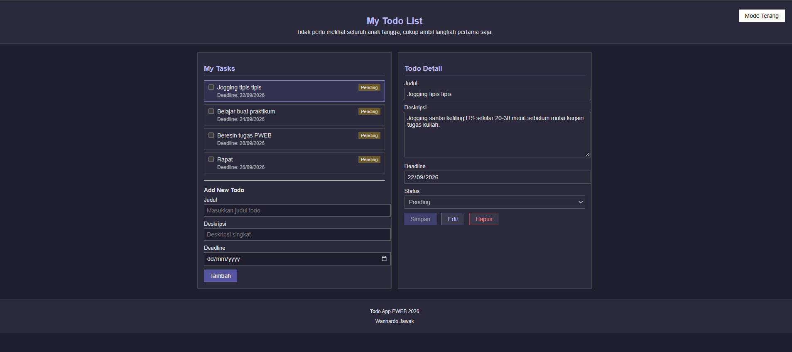

### Mobile
Pada tampilan mobile, kedua panel tidak lagi berdampingan. Panel My Tasks berada di atas, kemudian panel Todo Detail berada di bawahnya.
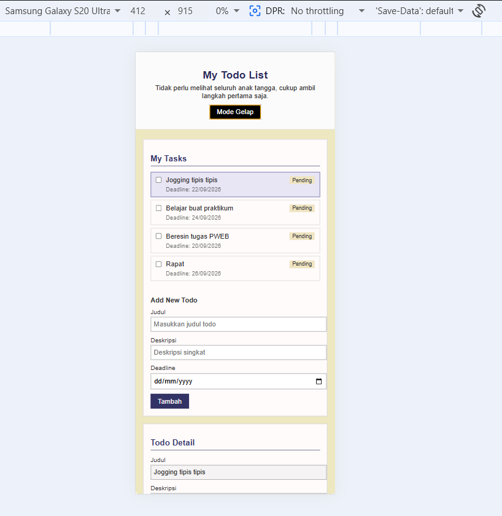

Default mobile dalam dark mode
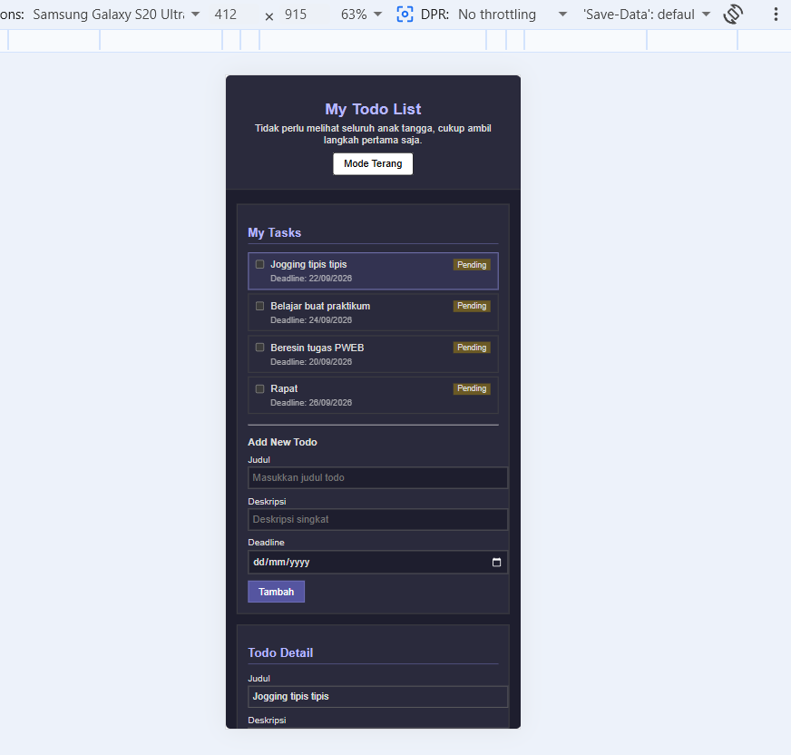

## Dokumentasi fitur
### 1. Tambah todo
Menambahkan todo baru tanpa harus melakukan refresh
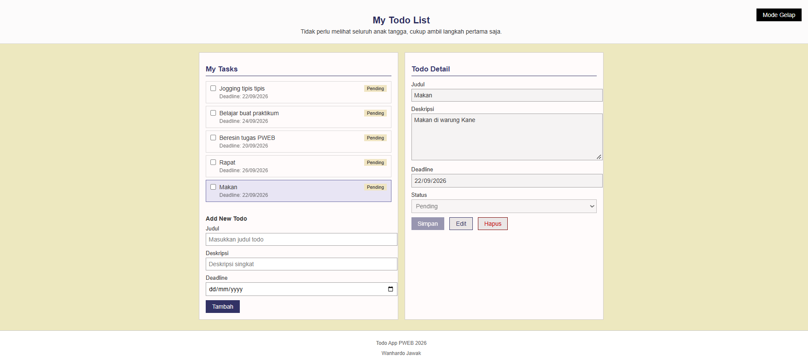

Muncul peringatan saat ingin menambahkan todo namun tidak mengisi judul
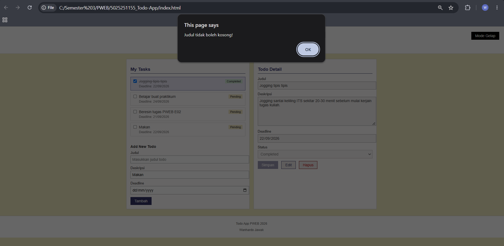

### 2. Edit todo
Melakukan editing pada todo yang dipilih
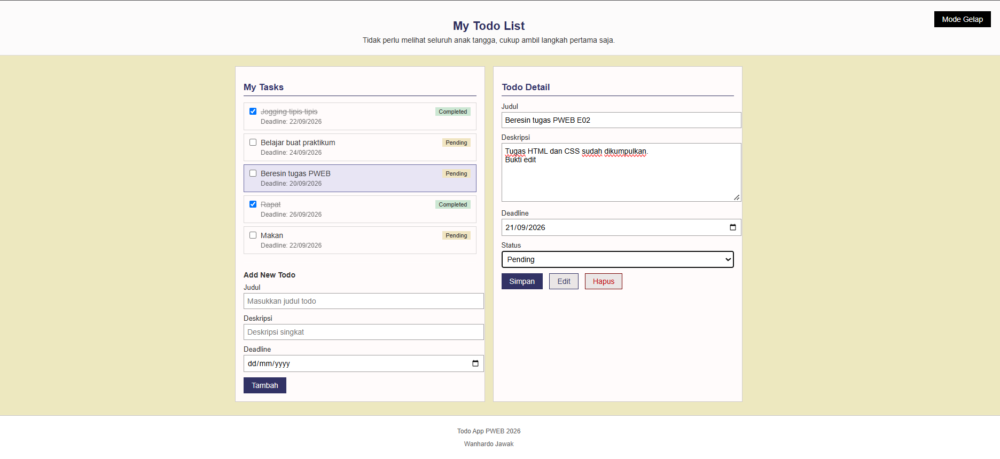

Berhasil mengedit todo, sehingga tampilan list pada panel kiri juga berubah
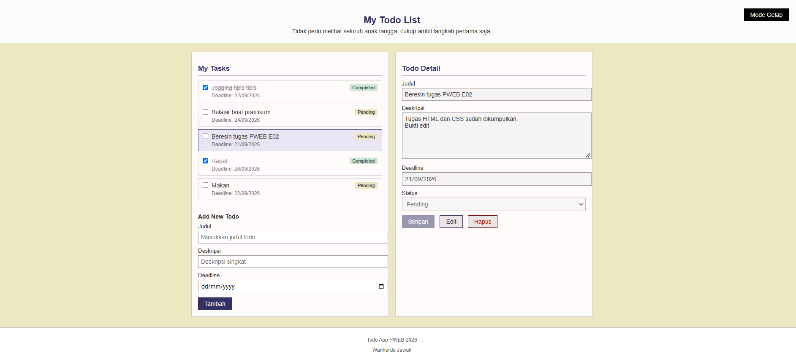

Melakukan check pada checkbox todo list yang juga mengubah status todo dari pending ke completed
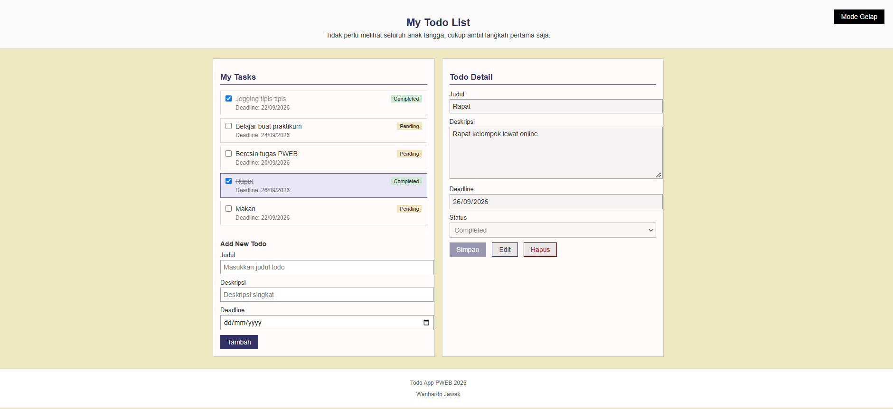

### 3. Hapus todo
Muncul warning pada saat ingin menghapus todo yang dipilih
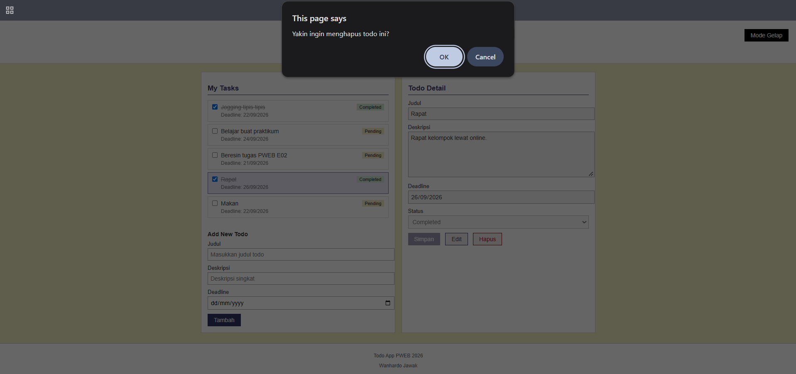

Todo berhasil di hapus dan tidak ada di dalam list todo
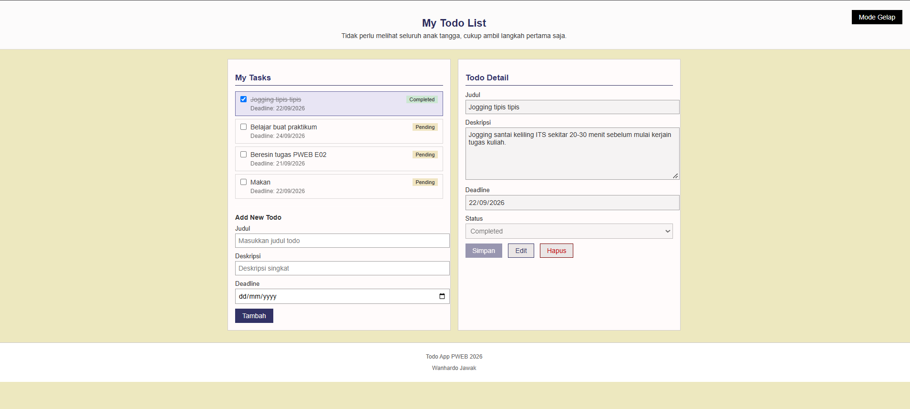

## 4. After Refresh
Saat melakukan refresh, tampilan kembali ke tampilan default tanpa perubahan
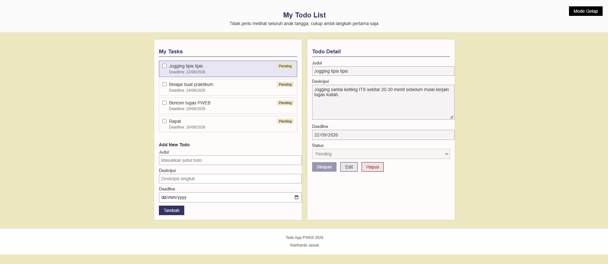
